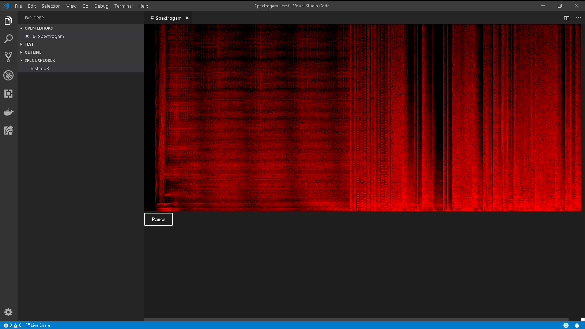

# Spectrogram

This is an extension that play and display spectrogram of mp3 audio files.

## Known Issues
Limited to mp3

## Release Notes

### 1.0.1

Fixed path issue other OS platforms (tested on MacOS and Ubuntu)

#### Note
Pumped up the VS Code requirement to 1.40 due to Web Audio API bug, probably from Chrome
- Just right after the 1st release, the Web Audio API stops working on 1.30 to 1.39 of VS code (VS code 1.38 stable build is on Electron 4 | Chrome 69)
- The extension is working (except the pause/resume function - API bug again) on VS code exploration build 1.37 with ELectron 6 | Chrome 76
- This extension will not be working for a while 😥

### 1.0.0

Initial release of Spectrogram

### References
https://developer.mozilla.org/en-US/docs/Web/API/Web_Audio_API  
https://github.com/mdn/webaudio-examples/blob/master/audiocontext-states/index.html  
https://wbrickner.wordpress.com/2016/09/27/awesome-js-html-spectrogram/