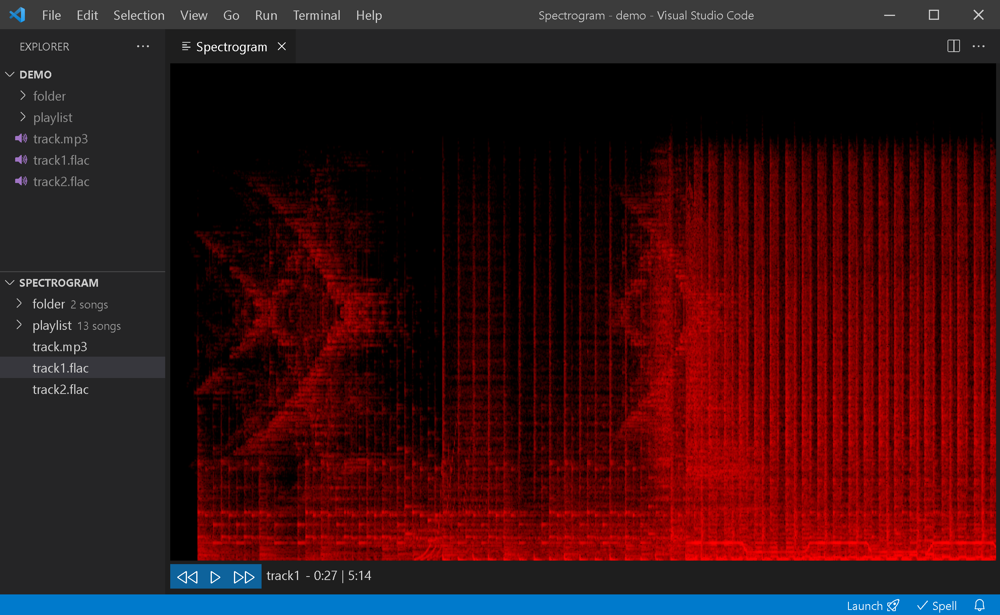

# Spectrogram
This is an extension that plays and displays spectrograms of mp3 and flac audio files. Are you curious to see how your favorite songs' spectrograms look? 🦝🤪💭

## Release Notes

### 3.0.0
- Added support for `WAV`
- Added seekbar
- Added color configuration
- Fixed bugs
- Improved treeview
- New logo and icon

### 2.0.0
- Added support for `FLAC`
- Added 5-second seeking buttons
- Greatly reduced extension size

### 1.1.0
- Improved UI
- Fixed pause/resume
- Fixed minor bugs
- Refactored code

### 1.0.1
- Fixed path issue for macOS

### 1.0.0
- Initial release of Spectrogram
