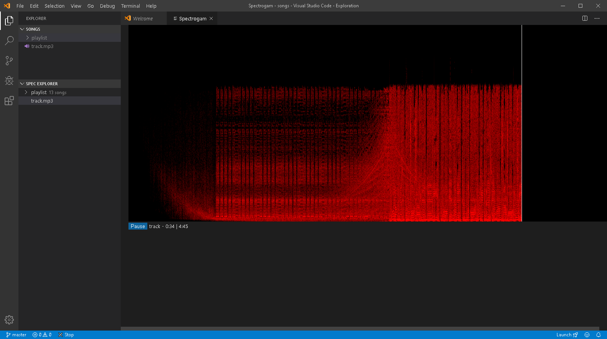

# Spectrogram
This is an extension that play and display spectrogram of audio files.

## Known Issues
- Mp3 doesn't work, yet! It's depend when VS Code decided to bundle with mp3 codec.

## Release Notes

### 1.1.0
- Improve UI
- Fixed pause/resume
- Fixed minor bugs
- Refactor code

### 1.0.1
Fixed path issue other OS platforms (tested on MacOS and Ubuntu)

### 1.0.0
Initial release of Spectrogram
